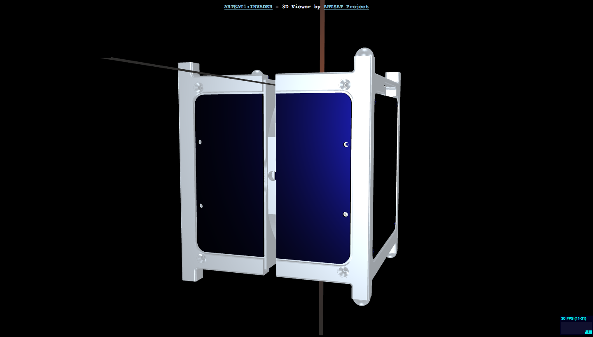

Invader3DViewer
====
A 3D viewer for INVADER, writted in Javascript.

## Description

[INVADER](http://artsat.jp/en/project/invader), a nano-satellite developed by [ARTSAT project](http://artsat.jp), can be viewed on your browser. 
You can zoom in/out and rotate the satellite.

## Demo

http://motokimura.github.io/invader-3d-viewer/

## Screenshot

## Requirements

A browser that supports WebGL (Google Chrome is recommended).

## License

[MIT License](LICENSE.txt)

## Team

[Motoki Kimura](https://github.com/motokimura)

[ARTSAT Project](https://github.com/ARTSAT)
